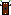

# AADC 2015 - FRUIT

The following code was written by FRUIT (Freiburg University Innovation Team) for the [Audi Autonomous Driving Cup](https://www.audi-autonomous-driving-cup.com) 2015. We achieved third place in the competition.

The `AADC` folder contains the components that were used during the competition as well as projects for calibration and data collection. `Freestyle` consists of the project used for the special presentation of a mind control application to send instructions to the car.

2015 - Gabriel Kalweit, Max Lohmann, Nicolas Riesterer, Oliver Worm, Minghao Xia